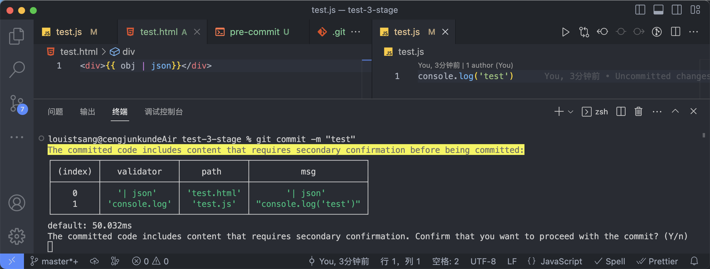

# git-stage-validator

Validate staged code before committing

> Windows PowerShell does not support `< /dev/tty`. It is recommended to use WSL or configure pre-commit without using `< /dev/tty`.


## Install

```
npm install git-stage-validator -D
```

## Usage

1. Install the package.
2. Customize validation rules (.stagerc.js).
3. Set up git-stage-validator to run during pre-commit.

---

It is recommended to use husky and the following is an example of using husky for pre-commit:

```
#!/usr/bin/env sh
. "$(dirname -- "$0")/_/husky.sh"

npx git-stage-validator

```

> If no configuration file is provided, it will be automatically generated.

## Documentation

- Validation Rules

```
export enum ValidatorType {
  forbid,
  confirm,
}
export interface ValidatorRule {
  name: string;
  type: keyof typeof ValidatorType;
  regex: RegExp;
  msg: string;
  files: (`*.${string}` | `*`)[];
}
```

- Customizing Prompt Messages
  .stagerc.js

```
tipsText: {
  includesConfirmContent: "",
}
```

## Q&A

- How to add validator?
  Locate the .stagerc.js file in your project and add rules. Here's an example of detecting 'console.log' in the `.tsx` file that is not allowed to be committed:

```
export default [
  {
    name: "console.log",
    type: "confirm",
    regex: /JSON\.stringify\(.+\)/,
    msg: `Detected 'console.log' in the tsx file being committed.`,
    files: ["*.tsx"]
  }
]
```

- How do I install and use it if I'm using Husky?
Add the following code to the `pre-commit` in `.husky`
```
npx git-stage-validator
```

- What should I do if I haven't installed Husky?
Here are the steps to install husky(v8.0.3)
```
npm install husky -D
npm pkg set scripts.prepare="husky install"
npm run prepare
npx husky add .husky/pre-commit "npx git-stage-validator"
git add .husky/pre-commit
```

## License

MIT
